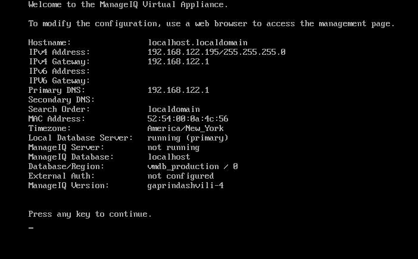
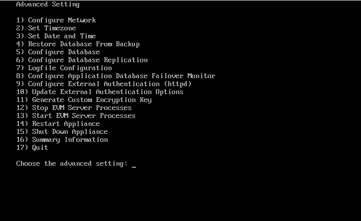

# Intorduction to ManageIQ
- ManageIQ is an Open Source Cloud management platform. The ManageIQ project founded by Red Hat In 2014 as a community  project. It is written in Ruby with RoR (Ruby on Rails) as platform.
- For getting started get a ManageIQ instances from [here](http://manageiq.org/download/)

---
### Installation
- Using KVM/Qemu image

    - Download ManageIQ Image from [manageiq/downloads](http://manageiq.org/download/) choose QEmu/KVM

    - Install KVM and necessary packages

            # yum install qemu-kvm libvirt libvirt-python virt-install
    
    - Create ManageIQ VM using existing image
        - Create VM using ```virt-install``` command

                # sudo virt-install --virt-type kvm  --import --name ManageIQ  --memory 12288 --vcpus 4 --cpu host  --disk manageiq-openstack-gaprindashvili-5.qc2,format=qcow2,bus=virtio  --network default,model=virtio   --os-type=linux --os-variant=centos7.0   --graphics spice
    
    - Launch VM using ```virsh ```
            
            # virsh start ManageIQ
    - Login using ssh
            
            # ssh root@<ip_of_server>
        - user: _root_
        - password: _smartvm_
---        
- Using docker image

    Docker image for ManageIQ is available. It can be run in Docker container. There are also other options like [Public cloud](http://manageiq.org/docs/get-started/cloud) or [Vagrant](http://manageiq.org/docs/get-started/vagrant) to get started with ManageIQ. It can run everywhere Docker is available.

    First thing, you have to install Docker in your system. Follow instructions in [Docker docs](https://store.docker.com/search?type=edition&offering=community) to install Docker.

    Start Docker service using

        $ sudo service docker start 
    or do 

        $ sudo systemctl start docker 
    ### Step 1: Pull Docker image of ManageIQ

        $ sudo docker pull manageiq/manageiq 
    or

        sudo docker pull manageiq/manageiq:gaprindashvili-4 
    It will download ManageIQ image from Docker registry. To see image list, run this

        $ sudo docker images ls 

    ### Stpe 2: Run Docker container

        $ sudo docker run --privileged -d -p 8443:443 manageiq/manageiq 

    or

        $ sudo docker run --privileged -d -p 8443:443 manageiq/manageiq:gaprindashvili-4

    It will run container in detached mode. ``` -p 8443:443``` will forward your base machine's _8443_ port requests to docker container's _443_ port. To see a list of running containers, execute

        $ sudo docker ps


    Now ManageIQ container is up and running at IP address [https://127.0.0.1:8443](https://127.0.0.1:8443)

    It has username as *admin* and the password is *smartvm*. Get the login and explore the world of ManageIQ.

    ### Step 3: To commit the changes Commit the container

    It can be useful to commit a container’s file changes or settings into a new image. This allows you to debug a container by running an interactive shell, or to export a working dataset to another server. 

        $ docker commit "container_id" manageiq

    this saves all changes and data, next time run the ``` manageiq``` container.

---
### Appliance console and basic configuration

Running a command _appliance_console_  ot _ap_ to get into ManageIQ Virtual Appliance. It gives datails regarding ManageIQ Machine such as,



- hostname 
- IPv4 Address
- IPv4 Gateway
- IPv6 Address
- IPv6 Gateway
- Primary DNS
- Secondary DNS
- Search Order
- Mac Address
- TimeZone
- Local Database Server
- ManageIQ Server
- ManageIQ Database
- Database/Region
- External Auth
- ManageIQ Version

Pressing Enter will lead to the Advanced Settings



1. Configure Network
2. Set Timezone
3. Set Date and Time
4. Restore Database From Backup
5. Configure Database
6. Configure Database Replication
7. Logfile Configuration
8. Configure Application Database Failover Minitor
9. Configure External Authentication (httpd)
10. Update External Authentication Options
11. Generate Custom Encryption Key
12. Stop EVM server Processes
13. Start EVM server Processes
14. Restart Appliance
15. Shut Down Appliance
16. Summary Information
17. Quit
